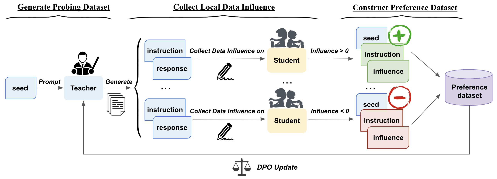

# Montessori-Instruct: Generate Influential Training Data Tailored for Student Learning
This is the official repository for [Montessori-Instruct: Generate Influential Training Data Tailored for Student Learning](https://arxiv.org/abs/2410.14208). In this work, we propose a novel data synthesis framework that tailors the data synthesis ability of the teacher toward the student’s learning process.



---

Updates:

:tada: [**2024-10-11**] We release the paper, codes, and synthetic datasets related to Montessori-Instruct.

<details open>
  <summary><b>🔗 Table of Contents</b></summary>

1. [Prepare](#prepare)
   - [Environment](#step-1-install-requirements)
   - [Setup](#step-2-set-up-environmental-variables)
   - [Models and Datasets](#step-3-models-and-datasets)
2. [Quick Start](#fire-quick-start)
3. [Step by Step Control](#gear-step-by-step-control)
   - [Step1: Generate Warmup and Probing Dataset](#step-1-generate-warmup-and-probing-dataset)
   - [Step2: Warmup the Student](#step-2-warmup-the-student)
   - [Step3: Collect Local Data Influence](#step-3-collect-local-data-influence)
   - [Step4: Update the Teacher](#step-4-update-the-teacher)
   - [Step5: Generate the Synthetic Dataset for student's training](#step-5-generate-the-synthetic-dataset-for-students-training)
4. [Evaluation](#evaluation)
5. [Citation](#citation)

</details>

# Prepare

### Step 1: Install Requirements
```bash
git clone git@github.com:cxcscmu/Montessori-Instruct.git montessori
cd montessori

# tested under Python 3.10.14
pip install -r requirements.txt
pip install flash-attn --no-build-isolation
```

### Step 2: Set up Environmental Variables 

1. If you are going to use models from [**Hugging Face**](https://huggingface.co/), please set up your Hugging Face cache path.
```bash
export HF_HOME=xxx
```

2. We use [**Weights and Biases**](https://wandb.ai/site/) to log the training process. Please log in to your wandb account first.
```bash
wandb login
```

3. We use [**Huggingface Accelerate**](https://huggingface.co/docs/accelerate/index) to full parameters fine tune the students. Please set your accelerate environment config file first:
```bash
# for Llama3-8B models
accelerate config --config_file ./configs/fsdp.yml 
# for Tinyllama-1.1B models
accelerate config --config_file ./configs/ddp.yml 
```

### Step 3: Models and Datasets

1. 🤖 **Models:** In our main experiments, we use [**Llama3-8B-Instruct**](https://huggingface.co/meta-llama/Meta-Llama-3-8B-Instruct) as the teacher model and [**Llama3-8B**](https://huggingface.co/meta-llama/Meta-Llama-3-8B) and [**TinyLlama-1.1B**](https://huggingface.co/TinyLlama/TinyLlama_v1.1) as the student models. Please ensure you have access to Meta Llama3 series models beforehand.
2. 🔎 **Datasets:** We use the [**alpaca_gpt4**](https://github.com/Instruction-Tuning-with-GPT-4/GPT-4-LLM) dataset as the seed dataset.

# :fire: Quick Start
Here we provide a quick start to go through the whole data synthesis pipeline.

Step 1: Setup your project config in `project_config.yml`. 
```yaml
project_name: your_project_name # your project name
teacher_model_name_or_path: meta-llama/Meta-Llama-3-8B-Instruct # the path of the teacher model
student_model_name_or_path: TinyLlama/TinyLlama_v1.1 # the path of the student model
fsdp_or_ddp: ./configs/ddp.yml # the path of the accelerate config file

training_dataset_num: 100 # the number of synthetic data for student training
probing_dataset_num: 20 # the number of probing data for local data influence collection
warmup_dataset_num: 100 # the number of warmup data for student warmup

num_gpus: 8
```

Step 2: Run the following command:
```bash
python gen_configs.py
```
to generate all the config files under `configs/your_project_name`, including the training scripts under the `scripts/your_project_name` folder. 

Step 3: Start your quick project by running:
```bash
bash ./scripts/your_project_name/run_all.sh
```

You can find the synthetic data under the `./data/your_project_name` folder and the logs under the `./logs/your_project_name` folder.

:warning: Since the time required for local data collection cannot be overlooked, we recommend **starting with a small amount of data** to get an initial understanding of the Montessori-Instruct pipeline. You'll gain more fine-grained control over the data generation process in the subsequent step-by-step stages.


# :gear: Step by Step Control

### Step 1: Generate Warmup and Probing Dataset
We require two datasets: one for warming up the student (warmup dataset) and another for collecting local data influence (probing dataset). The `gen_warmup_and_probing_dataset.yml` file contains the parameters for this step. You need to create `gen_warmup_and_probing_dataset.yml` first, and you can look at the template config file under configs/templates.
Then run the following command to generate the datasets:
```bash
# Generate the instructions first
python ./src/gen_instructions.py --config_file ./configs/gen_warmup_and_probing_dataset.yml 
# Generate the responses then
python ./src/gen_responses.py --config_file ./configs/gen_warmup_and_probing_dataset.yml 
# Divide the dataset into warmup and probing datasets separately
python ./src/divide_dataset.py --config_file ./configs/gen_warmup_and_probing_dataset.yml 
```

### Step 2: Warmup the Student
`warm_up.yml` contains the parameters for warming up the student. Once you've configured this file, you can run the following command to initiate the warmup process:
```bash
accelerate launch --config_file ./configs/ddp.yml ./src/warm_up.py --config_file ./configs/warm_up.yml # for the Tinyllama-1.1B model; change ddp to fsdp for Llama3-8B series models.
```

:warning: The warmup checkpoint will contains both the parameters and the optimizer states, thus it takes around **~6GB** for Tinyllama and **~90GB** for Llama3-8B.

### Step 3: Collect Local Data Influence
In this step, we load the warmup checkpoint and use it to collect the local data influence based on the probing dataset. The `collect_local_data_influence.yml` file contains the parameters for this step. By default, we use the `alpaca_eval_gpt4_1106_preview` reference dataset, which has been downloaded with this repository.

After configuring, you can run the following command to collect the local data influence:
```bash
accelerate launch --config_file ./configs/ddp.yml ./src/collect_local_data_influence.py --config_file ./configs/collect_local_data_influence.yml # for Tinyllama-1.1B models; change ddp to fsdp for Llama3-8B models.
```


### Step 4: Update the Teacher
After collecting the local data influence, we can use them to create a preference dataset and update the teacher using this preference dataset. The `dpo_teacher.yml` file contains the parameters for this step.

Run the following command to update the teacher:
```bash
python ./src/dpo_teacher.py --config_file ./configs/dpo_teacher.yml
```

### Step 5: Generate the Synthetic Dataset for student's training
At this stage, we have obtained the optimized teacher model tailored to the student's learning process. Now, we use this teacher to generate the synthetic dataset for the student's training. The `gen_training_dataset.yml` file contains the parameters for generating the synthetic dataset, and `train_student.yml` contains the parameters for training the student.

Run the following command to generate the synthetic dataset:

```bash
# First generate the training dataset for student models
python ./src/gen_instructions.py --config_file ./configs/gen_training_dataset.yml

python ./src/gen_responses.py --config_file ./configs/gen_training_dataset.yml

# Then train the student model
accelerate launch --config_file ./configs/ddp.yml ./src/train_student.py --config_file ./configs/train_student.yml
```


# Evaluation
We evaluate the instruction-following ability of the student trained with Montessori-Instruct synthetic data using the [**Alpaca Eval 2.0**](https://github.com/tatsu-lab/alpaca_eval/blob/main/README.md) (in-domain) and [**MT-Bench**](https://github.com/lm-sys/FastChat/tree/main/fastchat/llm_judge) (out-of-domain) benchmarks. Additionally, we employ the [**lm-evaluation-harness**](https://github.com/EleutherAI/lm-evaluation-harness) to evaluate the student's general performance on MMLU, GSM8K, and other benchmarks.

# Bugs or Questions
If you have any questions regarding the code or the paper, feel free to contact Xiaochuan (lixiaochuan20@gmail.com). If you encounter any problems when using the code or want to report a bug, you can open an issue to provide detailed information to help us assist you more effectively and efficiently.

# Citation
Please cite our paper if you use Montessori-Instruct in your work:
```bibtex
@misc{li2024montessoriinstructgenerateinfluentialtraining,
      title={Montessori-Instruct: Generate Influential Training Data Tailored for Student Learning}, 
      author={Xiaochuan Li and Zichun Yu and Chenyan Xiong},
      year={2024},
      eprint={2410.14208},
      archivePrefix={arXiv},
      primaryClass={cs.CL},
      url={https://arxiv.org/abs/2410.14208}, 
}
```
